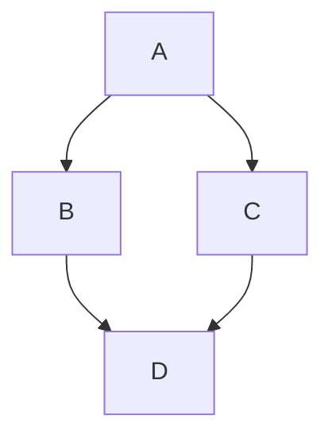
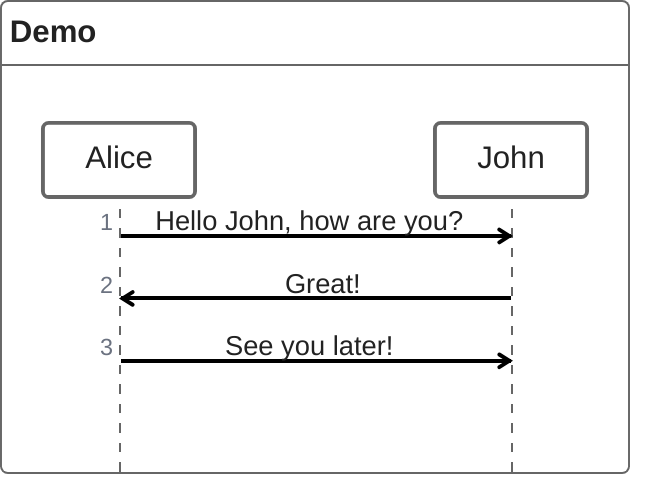
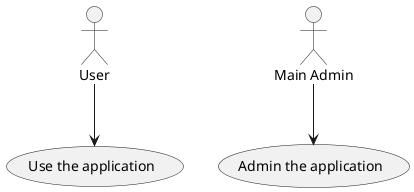

# diagramasUML
Repo para probar diagramas con MErmaid, ZenUML y PlantUML

## Diagramas Mermaid

```mermaid
graph TD;
    A-->B;
    A-->C;
    B-->D;
    C-->D;
```

## Diagramas ZenUML

```mermaid
zenuml
    title Demo
    Alice->John: Hello John, how are you?
    John->Alice: Great!
    Alice->John: See you later!
```

## Diagramas PlantUML

```plantuml
@startuml
:User: --> (Use)
"Main Admin" as Admin
"Use the application" as (Use)
Admin --> (Admin the application)
@enduml
```
